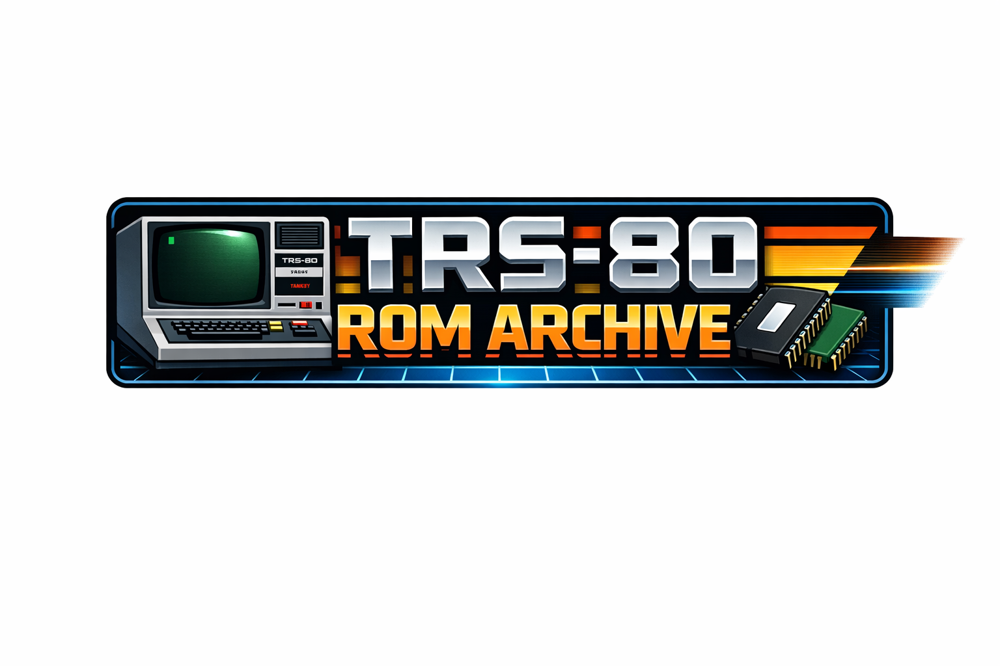

# TRS-80 ROM Archive

A curated collection of ROM dumps for the TRS-80 family of computers, organized, identified, and checksum-verified.

This repository focuses on preserving known ROM images across multiple TRS-80 systems with consistent naming, metadata, and validation.

------------------------------------------------------------
SUPPORTED SYSTEMS
------------------------------------------------------------

- Model I
- Model II / 12 / 16 / 16B / 6000
- Model III
- Model 4 / 4P
- Color Computer (CoCo 1 / 2 / 3)

------------------------------------------------------------
FILE NAMING CONVENTION
------------------------------------------------------------

ROM files are named using the following structure:

<system>_<location>_[SUM16].rom

Examples:

m2_U11_[1BBE].rom  
m3_U4_[BBC4].rom  
m1_lvl2_v1.3_U6_[B078].rom  

Where:

- <system>     = machine identifier (m1, m2, m3, m4, coco, etc)
- <location>   = physical IC position (Uxx)
- [SUM16]      = 16-bit additive checksum of ROM contents

------------------------------------------------------------
CHECKSUMS
------------------------------------------------------------

Each ROM is identified using:

- SUM16  → 16-bit additive checksum (primary ID)  
- CRC32  → secondary verification (when available)  

SUM16 is used as the canonical identifier because:

- It matches historical ROM labeling practices  
- It is fast and deterministic  
- It distinguishes minor variations  

------------------------------------------------------------
ROM TYPES
------------------------------------------------------------

Common ROM types in this archive:

- 2316   (2 KB mask ROM)  
- 2716   (2 KB EPROM)  
- 2732   (4 KB EPROM)  
- 2764   (8 KB EPROM)  
- 27128  (16 KB EPROM)  
- 27256  (32 KB EPROM)  

------------------------------------------------------------
NOTES
------------------------------------------------------------

- Disassembled `.asm` files are auto-generated and may:
  - contain errors  
  - misinterpret data as code  
  - not reassemble cleanly  

- ROM sets may vary by:
  - hardware revision  
  - region  
  - patch level  
  - manufacturing differences  

- Some ROMs labeled "bad" are historically known patched or broken variants.

------------------------------------------------------------
GOALS
------------------------------------------------------------

- Preserve ROM images in a consistent format  
- Provide reliable identification via checksums  
- Map ROMs to real hardware (Uxx positions, IC types)  
- Document known variations and revisions  
- Support emulator and hardware restoration use  

------------------------------------------------------------
CONTRIBUTING
------------------------------------------------------------

If you have additional ROM dumps:

- Ensure raw, unmodified data  
- Provide source (machine, board, IC location)  
- Include checksum output if available  

Pull requests are welcome.

------------------------------------------------------------
DISCLAIMER
------------------------------------------------------------

This repository is for preservation and research purposes.

All trademarks belong to their respective owners.
